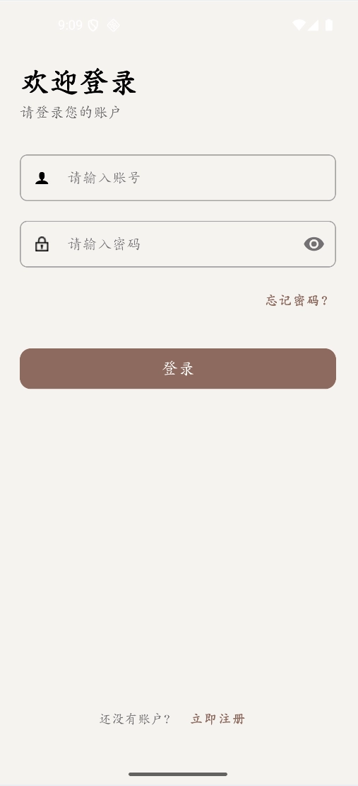
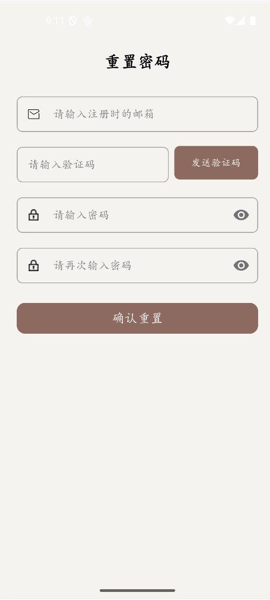
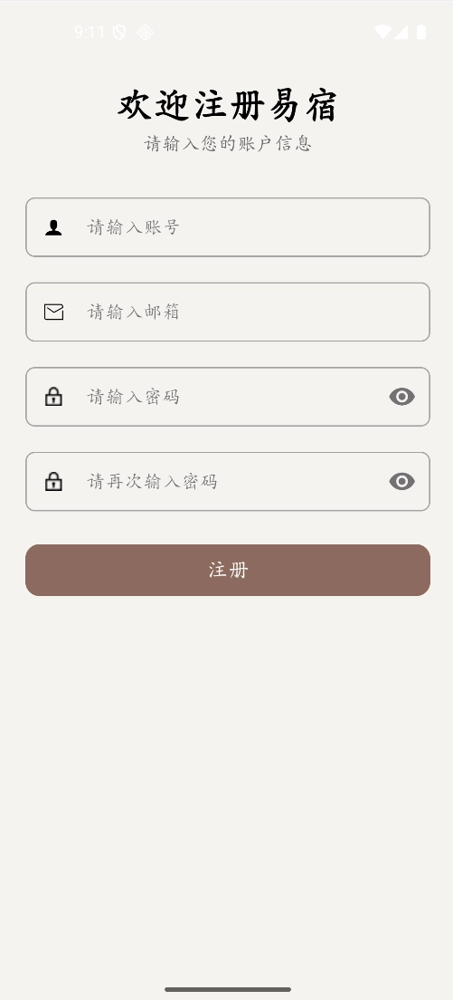
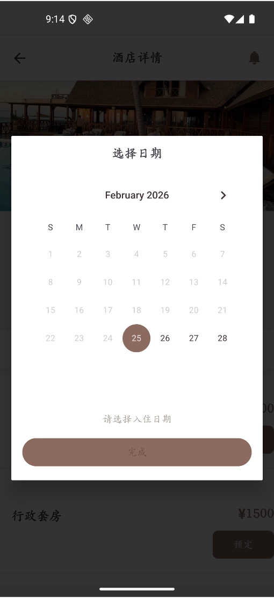
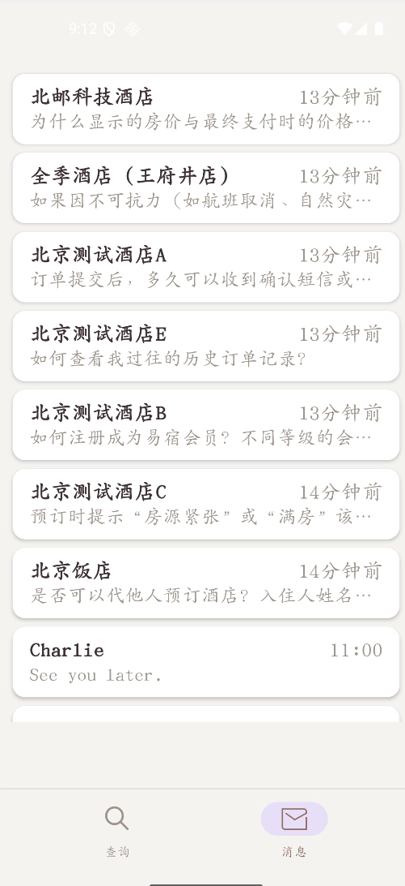
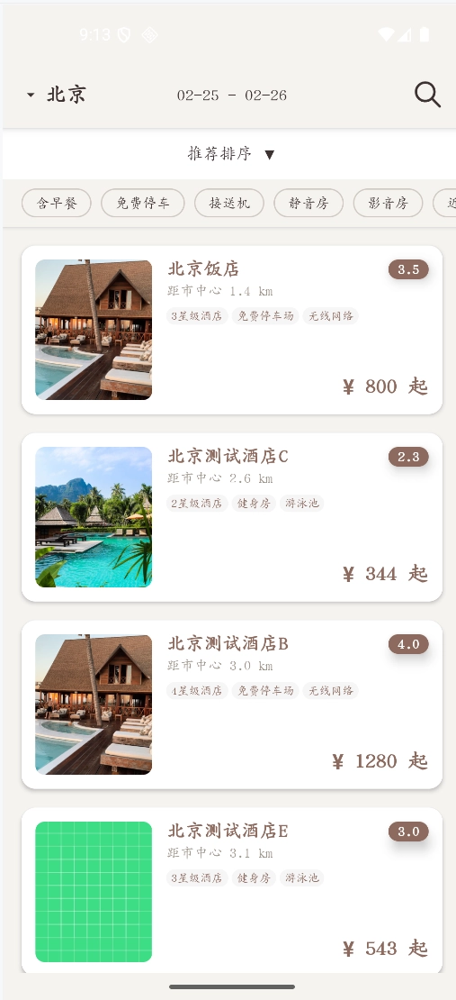
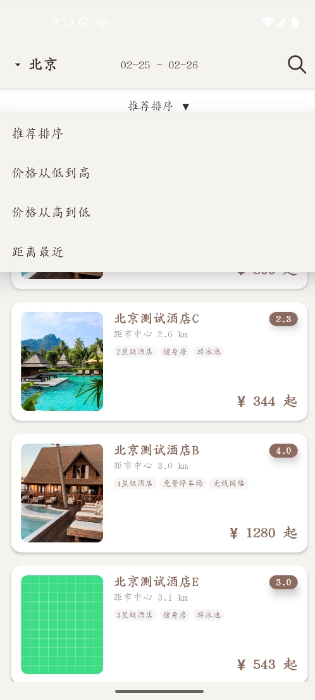
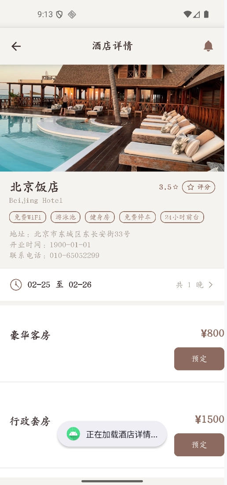
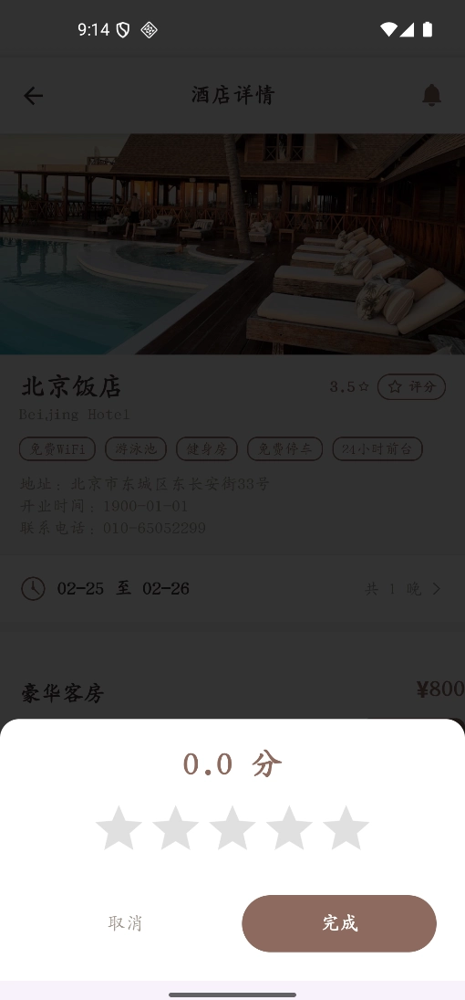
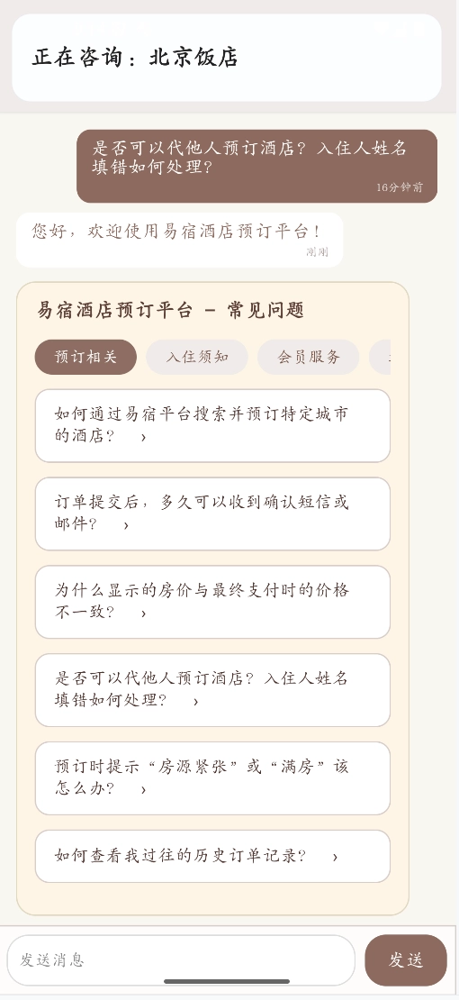

# 易宿酒店预订平台 - 客户端技术文档

## 1. 简介

**易宿酒店预订平台**是一个面向现代旅游出行场景的综合服务体系。本项目客户端聚焦于**用户端体验优化**，通过简洁直观的交互流程帮助用户快速找到符合需求的优质酒店。同时，集成了**实时消息功能**，为用户提供便捷的沟通渠道。

本文档详细阐述了客户端的架构设计、功能实现（含酒店预订与消息功能）、关键技术点及开发挑战。

## 2. 交付信息

| 项目             | 内容                                                         |
| :--------------- | :----------------------------------------------------------- |
| **交付项**       | 客户端训练营 - 课程项目 - 酒店预订平台          |
| **产物地址**     | https://github.com/RIVERIIIIII/eStay_Hotel_Reservation               |
| **代码运行截图** | 
   

   

   
|

## 3. 实现的功能列表

### 3.1 酒店预订功能 (用户端核心流程)

依据项目需求，客户端完整实现了**用户端预定流程**，包含查询、列表筛选及详情预订三大核心页面。

| 页面模块 | 功能说明 | 实现细节与技术点 |
| :--- | :--- | :--- |
| **酒店查询页 (首页)** | 1. **顶部 Banner**: 展示酒店广告或精选推荐，点击后直接跳转至该酒店的详情页。 2. **核心查询区域**: &emsp;a. **当前地点**: 支持自动定位获取当前城市。 &emsp;b. **关键字搜索**: 支持输入位置、品牌或酒店名进行模糊搜索。 &emsp;c. **入住日期选择**: 集成日历组件，支持选择入离日期并自动计算间夜数。 &emsp;d. **筛选条件**: 支持按酒店星级&价格区间（双向滑块）进行筛选。 &emsp;e. **快捷标签**: 提供“免费wifi”、“免费停车场”等快捷选项。 3. **查询按钮**: 点击后携带所有搜索条件跳转至列表页。 | **UI交互**: `HotelSearchFragment` 作为应用首页。 **组件**: 使用 `CalendarDialogFragment` 实现日历选择，`RangeSlider` 实现价格区间控制。 |
| **酒店列表页** | 1. **顶部核心筛选**: 顶部常驻筛选头，支持在列表页直接修改城市、入离日期及关键字，无需返回首页。 2. **详细筛选区域**: 提供排序（推荐/距离/价格）及更多快捷标签筛选。 3. **酒店列表**:  &emsp;- 展示酒店缩略图、店名、评分、距离及最低起价。 &emsp;- 支持**上滑自动加载**更多数据。 &emsp;- 列表项点击跳转详情页。 | **性能优化**: 使用 `RecyclerView` 高效渲染列表。 **数据加载**: 实现分页加载逻辑，提升长列表流畅度。 |
| **酒店详情页** | 1. **顶部导航**: 清晰显示酒店名称，支持快速返回。 2. **大图 Banner**: 支持左右滚动查看酒店提供的多张高清图片。 3. **基础信息**: 聚合呈现酒店星级、开业时间、设施标签、详细地址及联系电话。 4. **日历+人间夜 Banner**: **吸顶设计 (Sticky Header)**，上滑时固定在顶部，方便用户随时查看或修改入离日期。 5. **房型价格列表**: 展示各类房型信息，价格默认**从低到高排序**，点击“预定”直接跳转下单。 | **视觉效果**: 采用 `CoordinatorLayout` + `CollapsingToolbarLayout` 实现沉浸式头部折叠效果。 **交互细节**: 悬浮日期条确保了长页面下的操作便捷性。 |
| **预订确认页** | 1. **信息确认卡片**: 显示酒店名称、入住/离店日期、总晚数。 2. **房型信息**: 展示房型与核心描述（如床型/是否含早）。 3. **价格合计**: 本地计算总价=房价×晚数并高亮显示。 4. **确认预定**: 点击后进行下单成功提示并返回。 | **数据来源**: 通过 `RoomTypeAdapter` 从 `HotelDetailActivity` 获取酒店ID/名称与日期，使用 `Intent` Extra 传递至 `BookingConfirmationActivity`。 **UI结构**: `ConstraintLayout` + `CardView` + `MaterialButton`（底部确认）。 **交互**: 顶部 `Toolbar` 点击返回；确认按钮触发成功提示并 `finish()`。|

### 3.2 消息功能

客户端集成了完整的即时通讯模块，支持用户间的实时沟通与离线消息查看。

| 功能模块 | 实现情况 |
| :--- | :--- |
| **消息列表** | **✔ 已完成**。  • **UI 展示**: 清晰展示备注/用户名、最新消息摘要、时间与未读数角标。 • **离线可读**: 启动时优先加载本地 SQLite 历史会话。  • **实时更新**: 通过 WebSocket 接收新消息并自动置顶。  • **数据隔离**: 本地数据按“登录用户ID”隔离，互不干扰。 |
| **聊天对话** | **✔ 已完成**。  • **消息类型**: 支持文本收发与 FAQ 快速问答插入（从酒店详情进入时追加 FAQ 面板）。  • **实时性**: 动态插入并滚动到底部。  • **时间显示**: 友好时间文案（刚刚/xx分钟前/昨天 HH:mm 等）。 |
| **备注设置** | **✔ 已完成**。  • 支持修改联系人备注名，修改后**持久化**并在列表优先显示。 |
| **消息中心架构** | **✔ 架构优化**。  • **WebSocketManager 单例**: 全局管理长连接，生命周期与 Activity 解耦。  • **观察者模式**: 支持列表与聊天页同步更新。  • **会话存储隔离**: 按登录用户隔离聊天记录。 |

### 3.3 用户认证与个人中心

| 功能模块 | 核心流程 |
| :--- | :--- |
| **注册/登录** | • 支持账号密码注册/登录，集成后端 **JWT 认证**。 • 登录状态本地持久化，支持应用**冷启动自动登录**。 |
| **忘记密码** | • 完整的“验证身份 -> 校验验证码 -> 重置密码”三步流程。 |

## 4. 架构与关键设计思路

### 4.1 整体架构
- ### 系统分层架构设计

  本项目整体上采取了前后端分离架构，客户端采用经典的 Android 分层架构设计，各层职责明确，降低了模块间的耦合度：

  - **表现层 (Presentation Layer)**
    *   **MainActivity**: 采用 `BottomNavigationView` + `Fragment` 结构，包含 **HotelSearchFragment (酒店首页)** 和 **MessageFragment (消息功能)** 两个核心模块。
  
  - **业务逻辑与控制层 (Business Logic & Control Layer)**
    *   采用 MVC 模式思想，`Activity/Fragment` 作为控制器协调 UI 与数据。
    *   `AuthManager`、`WebSocketManager` 等单例模块封装核心业务规则。

  - **网络通信层 (Network Layer)**
    *   **HTTP 通道**: `Retrofit` + `OkHttp` 处理酒店预订与用户认证请求。
    *   **WebSocket 通道**: 独立 TCP 长连接处理实时消息推送。

  - **数据持久层 (Data Persistence Layer)**
    *   基于 Android 原生 **SQLite**，通过 `UserDbHelper` 单例管理 `user`、`conversations`、`chat_messages` 等核心数据表，确保持久化数据的完整性与迁移能力。

### 4.2 关键设计思路

| 设计点 | 优势 |
| :--- | :--- |
| **双核心 Tab 结构** | 首页聚合“酒店预订”与“消息”两大入口，满足用户“找房”与“沟通”的双重需求。 |
| **本地数据库迁移** | `UserDbHelper` 支持迁移；引入用户维度隔离，采用重建表策略以启用复合唯一约束（仅清空客户端本地聊天缓存，不影响服务端数据）。 |
| **沉浸式详情页** | 酒店详情页利用 `CoordinatorLayout` 实现头部折叠与 Banner 视差滚动，提升视觉体验。 |

### 4.3 预订确认页架构差异
- **轻量控制器**: `BookingConfirmationActivity` 仅做信息确认与本地价格计算，不直接发起网络/数据库操作，避免耦合。
- **数据传递方式**: 页面间采用 `Intent` Extra 传递酒店与日期信息，而非依赖全局单例，增强模块边界清晰度。
- **导航路径**: `HotelDetailActivity` → `RoomTypeAdapter` → `BookingConfirmationActivity`，由房型项的“预定”按钮发起跳转。
- **后续扩展**: 接入后端下单与支付模块时，将通过 `Retrofit` 在“业务逻辑与控制层”触发下单接口，并在“数据持久层”落地订单草稿/支付结果。

## 5. 遇到的挑战与解决方案

| 问题描述 | 解决方案 |
| :--- | :--- |
| **WebSocket 生命周期管理** | 引入 **`WebSocketManager` 单例** 全局管理连接，通过观察者模式分发消息，解决 Activity 切换导致的断连问题。 |
| **数据库连接并发崩溃** | 将 `UserDbHelper` 改造为单例模式，确保全局复用同一个 `SQLiteDatabase` 实例，避免 `Connection Pool Closed` 异常。 |
| **列表图片加载卡顿** | 全面集成 **Glide** 库，利用其内存+磁盘双级缓存机制及自动缩放功能，保障长列表滑动流畅。 |
