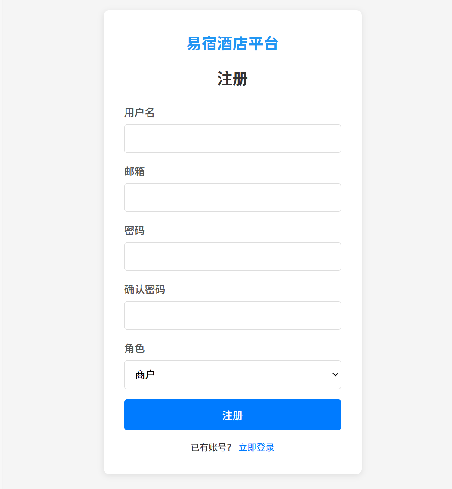
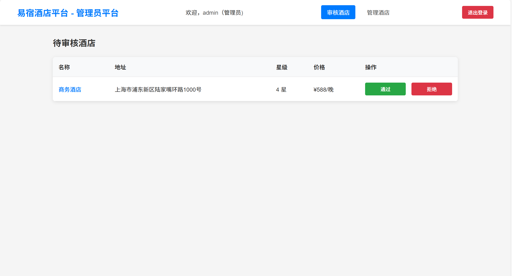
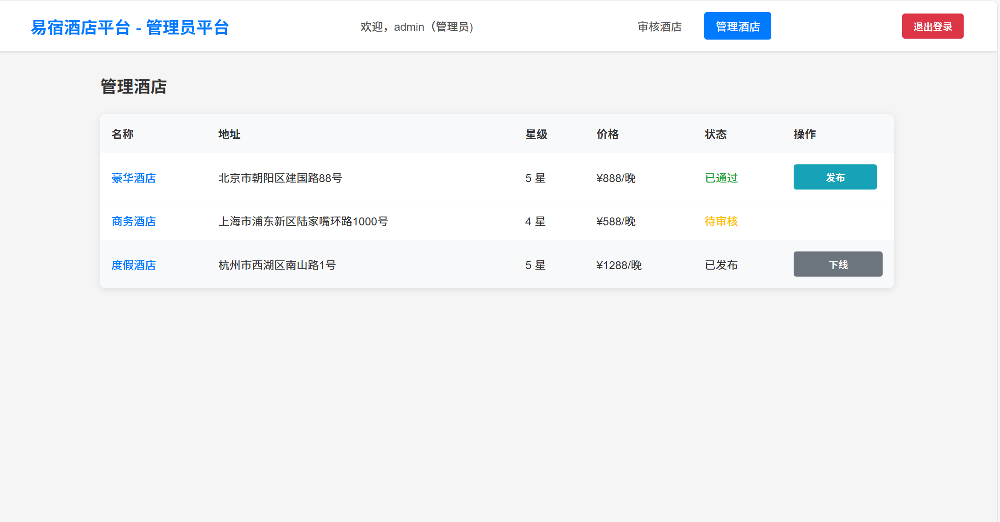
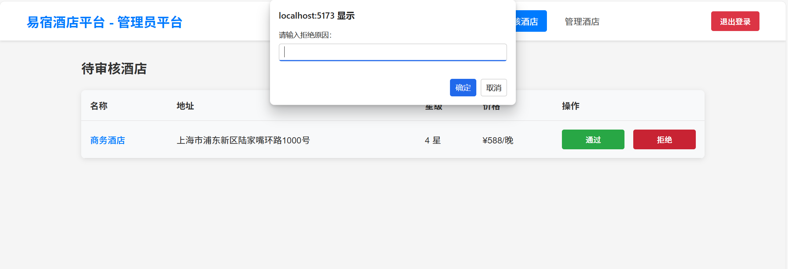
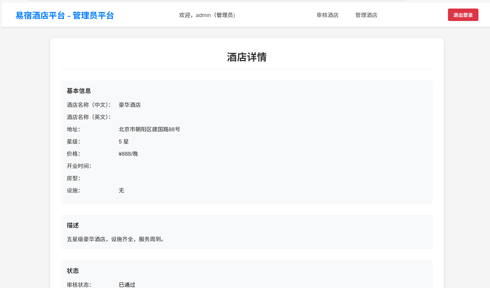

# 酒店管理系统 - PC端技术文档

## 1. 简介

本文档详细阐述了酒店管理系统的架构设计、功能实现、关键技术点及开发过程中的挑战与解决方案。该系统实现了用户认证、酒店管理、审核流程等核心模块，为商户和管理员提供了完整的酒店运营管理功能。

### 测试账户说明

请使用以下 Demo 账户进行功能测试：

- **管理员账户**：
  - 用户名：admin
  - 密码：admin123

- **商户账户**：
  - 用户名：merchant
  - 密码：merchant123

## 2. 交付信息

| 项目 | 内容 |
|------|------|
| 交付项 | 酒店管理系统 - PC端应用 |
| 产物地址 | d:\BaiduNetdiskDownload\Git\PC\hotel-management-system |

| 页面截图 | 描述 |
|----------|------|
|  | 登录页面 |
|  | 注册页面 |
|  | 商户酒店列表页面 |
|  | 商户会话页面 |
|  | 商户添加/编辑酒店页面 |
|  | 管理员审核酒店页面 |
|  | 管理员管理酒店页面 |
|  | 管理员酒店详情页面 |

## 3. 实现的功能列表

### 3.1 基础与核心功能

| 功能模块 | 功能点 | 实现情况 |
|----------|--------|----------|
| 认证系统 | 用户登录 | ✅ 已完成。实现了用户名密码登录，支持不同角色登录 |
| 认证系统 | 用户注册 | ✅ 已完成。支持商户和管理员角色注册 |
| 认证系统 | 忘记密码 | ✅ 已完成。提供密码重置功能 |
| 商户功能 | 酒店列表 | ✅ 已完成。展示商户所有酒店，支持状态显示和操作 |
| 商户功能 | 添加酒店 | ✅ 已完成。完整的酒店信息录入表单，支持设施选择 |
| 商户功能 | 编辑酒店 | ✅ 已完成。支持修改酒店所有信息 |
| 商户功能 | 删除酒店 | ✅ 已完成。支持酒店删除操作 |
| 商户功能 | 在线客服 | ✅ 已完成。提供商户与平台的沟通渠道 |
| 管理员功能 | 待审核酒店 | ✅ 已完成。展示所有待审核酒店列表 |
| 管理员功能 | 酒店审核 | ✅ 已完成。支持通过/拒绝酒店审核，拒绝时需填写原因 |
| 管理员功能 | 酒店详情 | ✅ 已完成。查看酒店详细信息 |
| 管理员功能 | 酒店管理 | ✅ 已完成。管理已审核酒店的发布状态 |

## 4. 架构与关键设计思路

### 4.1 整体架构

本项目采用前后端分离架构，前端基于 React + Vite 构建，主要包含以下层次：

- **表现层**：由 React 组件和页面组成，负责 UI 渲染和用户交互
- **路由层**：基于 React Router 实现页面导航和权限控制
- **状态管理**：使用 Context API 进行全局状态管理（如用户认证状态）
- **服务层**：封装 API 调用和业务逻辑，使用 mock 数据模拟后端接口
- **数据持久层**：使用 localStorage 存储用户认证信息

### 4.2 关键设计思路

| 设计点 | 实现方式 | 带来的优势 |
|--------|----------|------------|
| 基于角色的权限控制 | 使用 ProtectedRoute 组件，根据 user.role 进行路由保护 | 确保不同角色只能访问对应权限的页面，提高系统安全性 |
| 模块化组件设计 | 将 UI 拆分为可复用组件，如 Navbar 等 | 提高代码复用性和可维护性，减少重复代码 |
| 集中式状态管理 | 使用 AuthContext 管理用户认证状态 | 实现认证状态的全局共享，简化组件间状态传递 |
| 模拟数据服务 | 封装 mock 数据和 API 调用，模拟后端接口 | 前端开发独立于后端，可并行开发，提高开发效率 |
| 响应式表单处理 | 使用 useState 管理表单状态，实现实时验证 | 提供良好的用户体验，减少提交错误 |

## 5. 遇到的挑战与解决方案

| 问题描述 | 根本原因 | 解决方案 |
|----------|----------|----------|
| 权限控制实现 | 需要根据用户角色限制页面访问 | 实现 ProtectedRoute 组件，结合 AuthContext 进行权限判断 |
| 表单数据处理 | 酒店表单字段较多，状态管理复杂 | 使用 useState 统一管理表单状态，实现字段验证和错误提示 |
| 设施选择交互 | 设施多选需要友好的交互方式 | 实现标签式选择组件，支持点击切换选中状态 |
| 数据持久化 | 用户登录状态需要在页面刷新后保持 | 使用 localStorage 存储用户信息和 token，页面加载时恢复状态 |
| 模拟 API 调用 | 前后端分离开发时需要模拟后端接口 | 封装服务层，使用 mock 数据模拟 API 响应，保持与真实 API 格式一致 |

## 6. 技术栈与依赖

| 技术/依赖 | 版本 | 用途 |
|-----------|------|------|
| React | 19.2.0 | 前端 UI 库 |
| React DOM | 19.2.0 | React 渲染器 |
| React Router DOM | 7.13.0 | 页面路由管理 |
| Axios | 1.13.5 | HTTP 请求客户端 |
| Vite | 7.3.1 | 前端构建工具 |

## 7. 项目结构

```
hotel-management-system/
├── src/
│   ├── components/          # 通用组件
│   │   └── Navbar.jsx       # 导航栏组件
│   ├── context/             # 上下文管理
│   │   └── AuthContext.jsx  # 认证上下文
│   ├── pages/               # 页面组件
│   │   ├── Admin/           # 管理员页面
│   │   ├── Auth/            # 认证页面
│   │   └── Merchant/        # 商户页面
│   ├── services/            # 服务层
│   │   ├── adminService.js  # 管理员服务
│   │   ├── authService.js   # 认证服务
│   │   ├── hotelService.js  # 酒店服务
│   │   └── mockData.js      # 模拟数据
│   ├── App.jsx              # 应用主组件
│   └── main.jsx             # 应用入口
├── package.json             # 项目配置
└── vite.config.js           # Vite 配置
```

## 8. 运行与部署

### 8.1 开发环境运行

1. 安装依赖：
   ```bash
   npm install
   ```

2. 启动开发服务器：
   ```bash
   npm run dev
   ```

3. 访问地址：
   ```
   http://localhost:5173/
   ```

### 8.2 生产环境构建

1. 构建生产版本：
   ```bash
   npm run build
   ```

2. 构建产物位于 `dist` 目录，可部署到任何静态文件服务器。

## 9. 总结

本酒店管理系统实现了完整的商户和管理员功能，采用现代化的 React 技术栈构建，具有良好的用户体验和代码架构。系统通过模块化设计和权限控制，为不同角色的用户提供了专属的功能界面，满足了酒店运营管理的核心需求。

未来可考虑的优化方向：
- 接入真实后端 API，实现完整的前后端交互
- 增加数据可视化统计功能
- 优化移动端响应式布局
- 增加更多酒店运营相关的功能模块